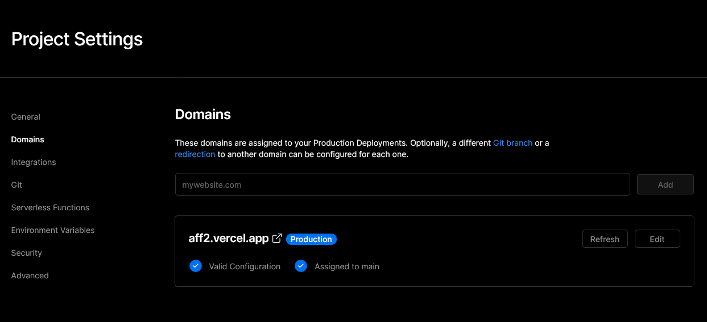

# HU Redirect

This project was created to help you guys out with using a custom domain together with your affiliate link. It's a simple 6-step process, takes about 10 min and is completely free.

<br  />

[](https://vercel.com/new/clone?repository-url=https%3A%2F%2Fgithub.com%2FDerMatte%2Fhu-redirect&env=AFFLIATE_URL&envDescription=Paste%20in%20your%20affiliate%20Link%20&envLink=https%3A%2F%2Fdiscord.com%2Fchannels%2F978750033400856586%2F978925835283222558)

## Getting Started

1.  [Create](https://github.com/signup) a GitHub Account if you don't already have one

2.  Click the button above and login with GitHub

<p  align="center">

</p>


3. Give your Repository a name and hit create

<p  align="center">


</p>

4. Paste in your affiliate Link and click Deploy
<p  align="center">
    
</p>

## Add your domain to Vercel

5. Last step is to link your domain to Vercel. If you don't already have a domain, you can [buy one directly on Vercel](https://vercel.com/domains). Now head over to your project dashboard and go to settings. Type in your domain, click add, and you'll see what configuration you have to change at your domain provider (Where you bought your domain).

<p  align="center">
    
</p>

Usually you have to add the following DNS Records:

```

Type    Name    Value

A       @       76.76.21.21
CNAME   www     cname.vercel-dns.com

```

6. Congratulations! You're done!

<br />

## FAQ

If you need help, have a look [at this Tutorial](https://vercel.com/docs/concepts/projects/custom-domains), which should cover all your questions regarding custom domains on Vercel. If not, feel free to ask me in the chat.
